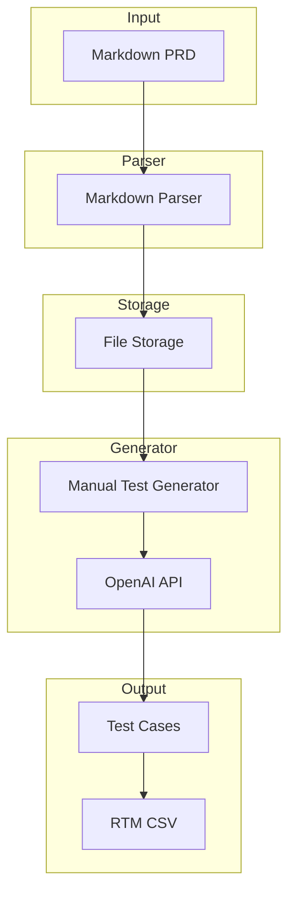
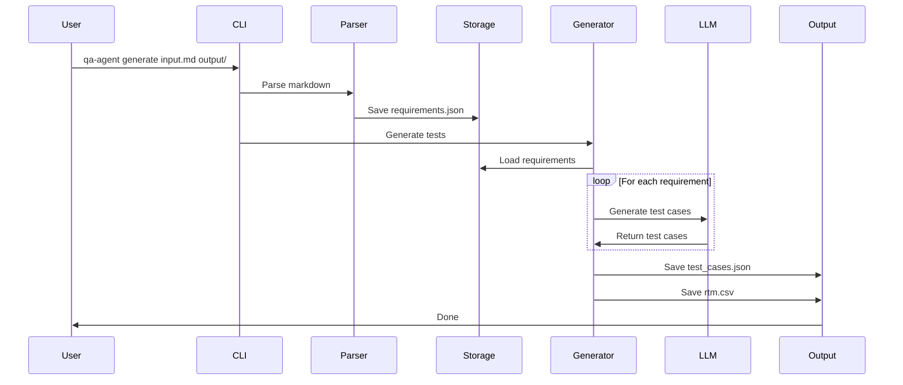

# Design Document: AI-Powered QA Agent (MVP)

## MVP Scope

This MVP focuses on delivering core value quickly: parsing Markdown requirements and generating manual test cases using LLM. Advanced features like RAG, vector stores, and multiple parsers are deferred to v2.

### MVP Goals
- Parse Markdown PRD documents
- Generate manual test cases using OpenAI API
- Produce basic RTM in CSV format
- Provide simple CLI interface
- Complete in 6-8 weeks vs 15 weeks

### Deferred to V2
- Multiple input formats (Jira, OpenAPI, SQL)
- Vector store and RAG pipeline
- MCP server integrations
- Multiple test generator types
- Advanced coverage analysis
- GitHub integration

## Simplified Architecture



## MVP Components

### 1. Markdown Parser
**Responsibility**: Parse Markdown PRD documents

**Implementation**:
```python
class MarkdownParser:
    def parse(self, markdown_content: str) -> List[Requirement]:
        """Parse markdown and extract requirements"""
        # Use simple regex or markdown library
        # Extract headings as requirement sections
        # Extract bullet points as individual requirements
        pass
```

**Dependencies**: `markdown` or `mistune` library

### 2. File Storage
**Responsibility**: Store parsed requirements in JSON

**Implementation**:
```python
class FileStorage:
    def save(self, requirements: List[Requirement], filepath: str) -> None:
        """Save requirements to JSON file"""
        pass
    
    def load(self, filepath: str) -> List[Requirement]:
        """Load requirements from JSON file"""
        pass
```

**Dependencies**: Standard library `json`

### 3. Manual Test Generator
**Responsibility**: Generate manual test cases using LLM

**Implementation**:
```python
class ManualTestGenerator:
    def __init__(self, openai_client):
        self.client = openai_client
    
    def generate(self, requirement: Requirement) -> List[TestArtifact]:
        """Generate test cases for a requirement"""
        prompt = self._build_prompt(requirement)
        response = self.client.chat.completions.create(
            model="gpt-4",
            messages=[{"role": "user", "content": prompt}]
        )
        return self._parse_response(response)
```

**Dependencies**: `openai` library

### 4. RTM Generator
**Responsibility**: Create simple CSV traceability matrix

**Implementation**:
```python
class RTMGenerator:
    def generate(self, requirements: List[Requirement], 
                 tests: List[TestArtifact]) -> str:
        """Generate CSV RTM"""
        # Create simple mapping
        # Export to CSV
        pass
```

**Dependencies**: Standard library `csv`

### 5. CLI
**Responsibility**: Simple command-line interface

**Implementation**:
```python
@app.command()
def generate(
    input_file: str,
    output_dir: str,
    api_key: str
):
    """Parse requirements and generate tests"""
    # Parse markdown
    # Generate tests
    # Create RTM
    # Save outputs
    pass
```

**Dependencies**: `typer`, `rich`

## Data Flow (MVP)



## Configuration (MVP)

Simple YAML config:

```yaml
openai:
  api_key: ${OPENAI_API_KEY}
  model: gpt-4
  temperature: 0.7
  max_tokens: 2000

output:
  format: json
  directory: ./output
```

## MVP Deliverables

1. **Core Package**
   - `qa_agent/models/` - Data models
   - `qa_agent/parsers/markdown.py` - Markdown parser
   - `qa_agent/storage/file.py` - File storage
   - `qa_agent/generators/manual.py` - Manual test generator
   - `qa_agent/analysis/rtm.py` - RTM generator
   - `qa_agent/cli.py` - CLI interface

2. **Documentation**
   - README with quick start
   - Example markdown PRD
   - Configuration guide

3. **Tests**
   - Unit tests for parser
   - Unit tests for generator
   - Integration test for full workflow

## Migration Path to V2

The MVP architecture is designed to evolve:

1. **Add Vector Store**: Replace FileStorage with VectorStore
2. **Add RAG**: Insert RAG layer between Storage and Generator
3. **Add Parsers**: Implement additional parser types
4. **Add Generators**: Implement API, UI, DB test generators
5. **Add MCP**: Integrate MCP servers for external tools

The plugin architecture and interfaces remain the same, making migration smooth.
