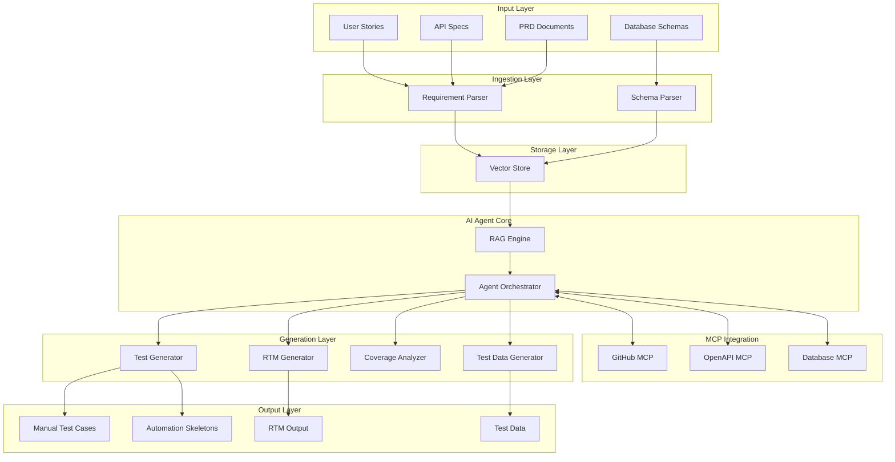
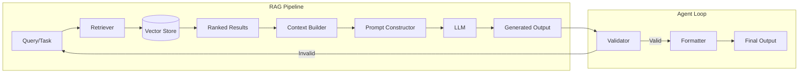
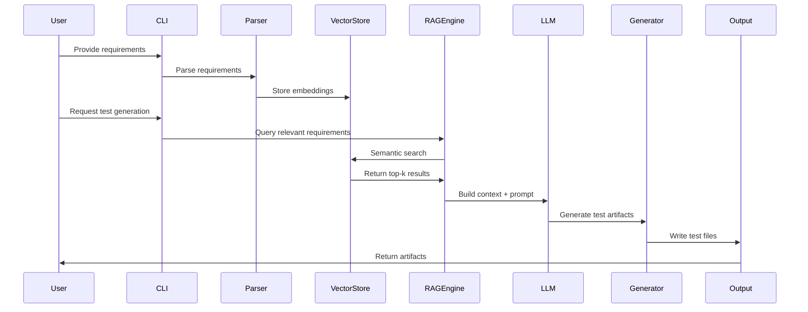

# Design Document: AI-Powered QA Agent

## Overview

The AI-Powered QA Agent is an intelligent test automation system that leverages AI agent architecture, Retrieval Augmented Generation (RAG), and Model Context Protocol (MCP) servers to automatically generate comprehensive testing artifacts from software requirements. The system ingests requirements from multiple formats (Jira user stories, API specifications, PRDs, database schemas) and produces manual test cases, automation test skeletons, requirement traceability matrices, and test data recommendations.

### Key Design Principles

- **Modularity**: Plugin-based architecture for parsers and generators
- **Extensibility**: Clear interfaces for adding new requirement formats and test generators
- **Context-Awareness**: RAG-based generation using semantic search over vectorized requirements
- **Tool Integration**: MCP server protocol for external tool access
- **Traceability**: Bidirectional linking between requirements and test artifacts
- **Performance**: Async operations, caching, and optimized vector search
- **Configurability**: Environment-based configuration for deployment flexibility

## Architecture

### High-Level System Architecture



### AI Agent Architecture with RAG Pipeline




### Data Flow Architecture



## Components and Interfaces

### 1. Requirement Parser

**Responsibility**: Ingest and parse requirements from multiple formats

**Interfaces**:

```python
class RequirementParser(ABC):
    @abstractmethod
    def parse(self, input_data: str) -> List[Requirement]:
        """Parse input and return structured requirements"""
        pass
    
    @abstractmethod
    def validate(self, input_data: str) -> ValidationResult:
        """Validate input format before parsing"""
        pass

class JiraParser(RequirementParser):
    """Parse Jira user stories"""
    pass

class OpenAPIParser(RequirementParser):
    """Parse OpenAPI/Swagger specifications"""
    pass

class MarkdownParser(RequirementParser):
    """Parse Markdown PRD documents"""
    pass

class TextParser(RequirementParser):
    """Parse plain text documents using NLP"""
    pass
```

**Key Operations**:
- Extract structured data from unstructured/semi-structured inputs
- Identify requirement type (functional, non-functional, constraint)
- Extract metadata (source, timestamp, priority)
- Generate semantic embeddings for vector storage
- Validate input format and return descriptive errors

**Dependencies**: NLP libraries (spaCy, NLTK), OpenAPI validators, embedding models


### 2. Schema Parser

**Responsibility**: Parse and analyze database schema definitions

**Interfaces**:
```python
class SchemaParser:
    def parse_sql(self, schema_sql: str) -> DatabaseSchema:
        """Parse SQL DDL statements"""
        pass
    
    def extract_tables(self, schema: DatabaseSchema) -> List[Table]:
        """Extract table definitions"""
        pass
    
    def extract_relationships(self, schema: DatabaseSchema) -> List[Relationship]:
        """Extract foreign key relationships"""
        pass
    
    def extract_constraints(self, table: Table) -> List[Constraint]:
        """Extract constraints (PK, FK, unique, check)"""
        pass
```

**Key Operations**:
- Parse SQL DDL statements
- Identify tables, columns, data types
- Extract primary keys, foreign keys, constraints
- Build relationship graph between tables
- Validate schema syntax

**Dependencies**: SQL parsers (sqlparse, sqlalchemy), graph libraries


### 3. Vector Store

**Responsibility**: Store and retrieve requirement embeddings for semantic search

**Interfaces**:
```python
class VectorStore:
    def store(self, requirement: Requirement, embedding: np.ndarray, metadata: Dict) -> str:
        """Store requirement with embedding and metadata"""
        pass
    
    def search(self, query_embedding: np.ndarray, top_k: int = 10, 
               filters: Dict = None) -> List[SearchResult]:
        """Semantic search with optional filters"""
        pass
    
    def update(self, requirement_id: str, embedding: np.ndarray, metadata: Dict) -> bool:
        """Update existing requirement"""
        pass
    
    def delete(self, requirement_id: str) -> bool:
        """Delete requirement"""
        pass
    
    def get_by_id(self, requirement_id: str) -> Requirement:
        """Retrieve requirement by ID"""
        pass
```

**Key Operations**:
- Generate embeddings using sentence transformers
- Store embeddings with metadata (source, type, timestamp)
- Perform similarity search with cosine distance
- Filter by metadata (requirement type, date range, source)
- Return results within 500ms for 10k requirements

**Technology Options**:
- **Chroma**: Lightweight, embedded, good for development
- **Qdrant**: High performance, production-ready, Docker deployment
- **Pinecone**: Managed service, scalable, cloud-based
- **Weaviate**: Open source, GraphQL API, hybrid search

**Recommendation**: Qdrant for balance of performance, features, and self-hosting
